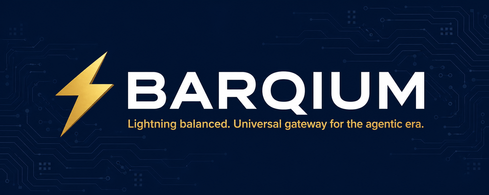
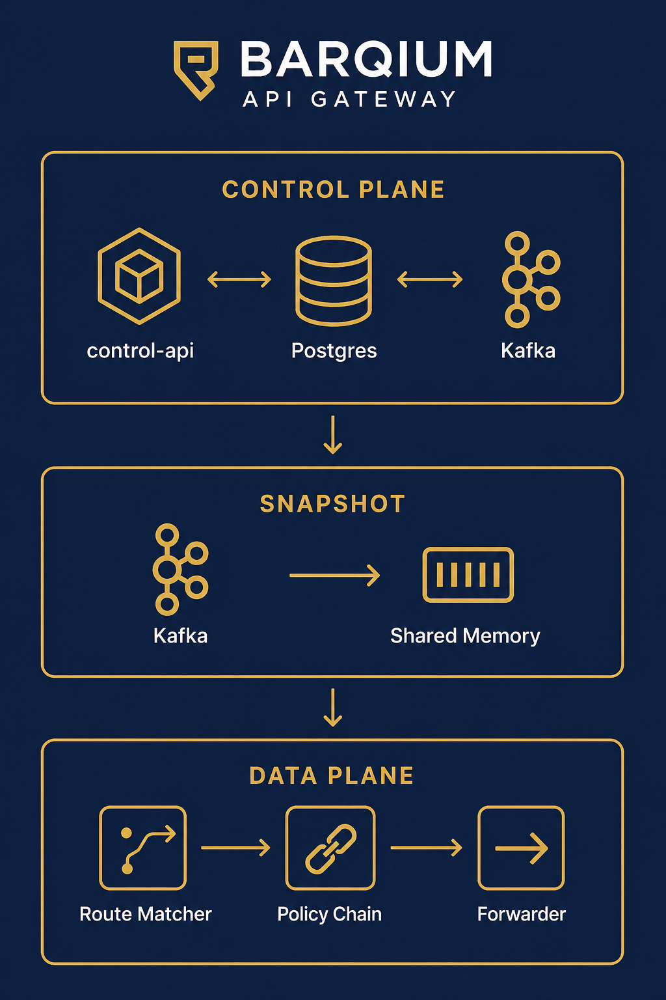

<div align="center">
  
</div>

<br/>

<div align="center">

[](LICENSE)
[](https://www.rust-lang.org)
[](https://go.dev)
[](https://github.com/YASSERRMD/Barqium/actions)

**Sub-millisecond API gateway built for the agentic era.**  
Route, secure, observe, and accelerate traffic across every protocol — HTTP/1.1, HTTP/2, HTTP/3, gRPC, WebSocket, SSE, GraphQL, SOAP — with first-class AI provider management, WASM plugin extensibility, and zero-copy shared-memory config propagation.

[Quick Start](#quick-start) · [Architecture](#architecture) · [Features](#features) · [Configuration](#configuration) · [Contributing](#contributing)

</div>

---

## Why Barqium

Modern agentic applications push traffic to dozens of upstream AI providers, microservices, and streaming endpoints simultaneously. Existing gateways were designed for stateless HTTP — they become bottlenecks the moment a workflow spans multiple LLM calls, tool invocations, and real-time SSE streams.

Barqium is purpose-built for this workload:

| Problem | Barqium's answer |
|---|---|
| Config changes take seconds to propagate | rkyv zero-copy snapshots on `/dev/shm` — sub-microsecond reads, no IPC |
| LLM costs spiral out of control | Per-model token budgets, cost ceilings, and fallback chains |
| Gateway plugins need redeploys | Hot-reloadable WASM plugins via wasmtime — drop a `.wasm`, live |
| Multi-region adds operational overhead | Built-in MirrorMaker2 integration and cross-region regions table |
| Auth is fragmented | JWT (JWKS auto-refresh), API keys, mTLS, OIDC — all pluggable |

---

## Quick Start

```bash
# 1. Clone and bootstrap toolchain
git clone https://github.com/YASSERRMD/Barqium.git && cd Barqium
make bootstrap          # installs Rust, Go, Node toolchains via mise

# 2. Start the full local stack
docker compose -f deploy/docker-compose.dev.yml up -d

# 3. Verify everything is up
./scripts/smoke_test.sh
```

The smoke test runs **23 end-to-end checks**: tenant creation, route/upstream CRUD, snapshot propagation, proxy round-trip, AI provider config, rate-limit policies, WASM plugin registry, and Kafka topic verification.

---


## Architecture

<div align="center">
  
</div>

### Technology Stack

| Layer | Technology | Role |
|---|---|---|
| **Data plane** | Rust · Tokio · hyper 1 | Sub-millisecond request proxying |
| **Control plane** | Go · chi · pgx · sqlc | Operator configuration management |
| **Event bus** | Redpanda / Kafka | Config changes, audit, telemetry |
| **Shared memory** | mmap-sync · rkyv | Zero-copy config snapshot reads |
| **TLS** | rustls 0.23 · quinn 0.11 | HTTP/1.1, HTTP/2, HTTP/3 (QUIC) |
| **WASM runtime** | wasmtime 25 · cranelift | Hot-reload plugin execution |
| **Telemetry** | OpenTelemetry · OTLP | Distributed traces and metrics |
| **Admin UI** | React 18 · Vite · Tailwind | Operator web dashboard |

---

## Features

### Data Plane

- **Protocol-universal proxy** — HTTP/1.1, HTTP/2, HTTP/3 (QUIC via quinn), gRPC, WebSocket, SSE, GraphQL (with persisted queries), SOAP 1.1/1.2
- **Zero-copy config** — rkyv-archived snapshots on `/dev/shm`; route lookups never block on IPC or network
- **Dynamic health checks** — background `HealthChecker` probes `{upstream}/health`; unhealthy upstreams are silently bypassed by the route matcher
- **Circuit breaker** — per-upstream closed/open/half-open state machine with configurable failure threshold and reset timeout
- **WASM plugin runtime** — hot-reloadable plugins via wasmtime; `on_request`/`on_response` hooks; host functions for header and variable manipulation
- **SO_REUSEPORT** — socket2-based multi-listener for kernel-level connection distribution without a single-threaded accept loop
- **BPF/XDP scaffold** — passthrough XDP program via aya (Linux + `xdp` feature flag)
- **AWS-LC TLS** — optional FIPS-compliant crypto via the `aws-lc` feature flag

### Policy Engine

- **JWT validation** — JWKS auto-refresh, RS256/ES256/HS256, audience/issuer claim verification
- **API key auth** — header and query-parameter strategies with Redis-backed lookup
- **Sliding-window rate limiter** — Redis-backed, per-consumer/tenant/IP/route scopes
- **PII redaction** — email and phone detection with a reversible token map
- **Code mode gate** — blocks LLM requests originating from developer contexts in production

### AI & MCP

- **Multi-provider LLM routing** — OpenAI, Anthropic, Groq, Ollama, AWS Bedrock (SigV4 signing)
- **Fallback chains** — ordered provider retry with per-model cost ceilings
- **Token budget enforcement** — per-request token limits and daily USD budget caps per model
- **Semantic cache** — HNSW approximate nearest-neighbour index (cosine distance) for prompt deduplication
- **MCP support** — client transports (HTTP+SSE, stdio), tool registry with RBAC, federated OAuth2 token store

### Control Plane

- **Full CRUD REST API** — tenants, upstreams, routes, policies, checkpoints, regions, AI providers, model policies, rate-limit policies, WASM plugins
- **Transactional outbox** — guaranteed-delivery config events via Kafka with at-least-once semantics
- **Config version pinning** — checkpoints and point-in-time rollback endpoint
- **Multi-tenant RBAC** — per-tenant resource scoping with OIDC operator login
- **Audit log** — 7-year Kafka-to-Postgres sink with partitioned time-series retention
- **Cross-region** — regions table with MirrorMaker2 integration for DR replication

### Observability

- **OTLP traces** — exported to Jaeger (or any OTLP-compatible collector) via opentelemetry-otlp
- **Structured access logs** — `AccessLogEntry` JSON published to `telemetry.access` Kafka topic
- **LLM telemetry** — token usage and cost events to `telemetry.llm`
- **Request telemetry** — full request/response metadata to `telemetry.requests`
- **Health endpoints** — `/health`, `/readyz`, `/livez` with graceful drain and SIGTERM support

---

## Repository Layout

```
Barqium/
├── crates/                     Rust workspace (data plane)
│   ├── barqium/                Binary entry point (feature flags: full · edge · aws-lc)
│   ├── barqium-core/           HTTP proxy runtime, health checker, circuit breaker
│   ├── barqium-config/         rkyv snapshot types (shared by snapshot + core)
│   ├── barqium-protocols/      GraphQL, SOAP, gRPC, WebSocket, SSE handlers
│   ├── barqium-policy/         JWT, API key, rate limit, PII redaction, code mode
│   ├── barqium-ai/             LLM provider adapters, semantic cache, fallback chains
│   ├── barqium-mcp/            MCP client/server, tool registry, OAuth2 token store
│   ├── barqium-snapshot/       Kafka consumer → rkyv snapshot compiler
│   ├── barqium-telemetry/      OTLP exporter, Kafka producer, access log emitter
│   ├── barqium-wasm/           wasmtime plugin runtime, host functions, file watcher
│   └── barqium-xdp/            SO_REUSEPORT helpers, BPF/XDP scaffold (Linux)
│
├── services/                   Go workspace (control plane)
│   ├── control-api/            REST admin API (chi · pgx · sqlc)
│   ├── outbox-worker/          Transactional outbox → Kafka publisher
│   ├── audit-consumer/         Kafka audit sink → Postgres
│   └── migrations/             Numbered SQL migrations (001–007)
│
├── ui/admin/                   React 18 + Vite + Tailwind admin dashboard
├── proto/                      Protobuf contracts (cross-language)
├── deploy/                     Docker Compose, Kubernetes manifests, Helm chart
├── docs/                       Architecture and operational documentation
├── benchmarks/                 Criterion micro-benchmarks
└── scripts/                    smoke_test.sh and utility scripts
```

---

## Configuration

### Data Plane Environment Variables

| Variable | Description |
|---|---|
| `LISTEN_ADDR` | Proxy listener address (default `0.0.0.0:9000`) |
| `HEALTH_ADDR` | Health endpoint address (default `0.0.0.0:9001`) |
| `SNAPSHOT_DIR` | Path to rkyv snapshot files (default `/dev/shm/barqium`) |
| `OTLP_ENDPOINT` | OTLP HTTP endpoint, e.g. `http://jaeger:4318` |
| `REDIS_URL` | Redis connection URL for rate limiting |
| `WASM_PLUGIN_DIR` | Directory of hot-reloadable `.wasm` plugins |
| `OPENAI_API_KEY` | OpenAI provider key |
| `ANTHROPIC_API_KEY` | Anthropic provider key |
| `GROQ_API_KEY` | Groq provider key |
| `OLLAMA_BASE_URL` | Ollama base URL |
| `AWS_ACCESS_KEY_ID` / `AWS_SECRET_ACCESS_KEY` / `AWS_REGION` | AWS Bedrock credentials |

### Control API Environment Variables

| Variable | Description |
|---|---|
| `DATABASE_URL` | Postgres connection string |
| `KAFKA_BROKERS` | Comma-separated broker list |
| `LISTEN_ADDR` | API server address (default `0.0.0.0:8080`) |
| `OIDC_JWKS_URL` | JWKS URL — leave empty to disable auth in dev |
| `OIDC_AUDIENCE` | Expected JWT audience |
| `OIDC_ISSUER` | Expected JWT issuer |

### Binary Feature Flags

```bash
# Full build (default): AI, MCP, WASM, all protocols
cargo build --release

# Stripped edge binary: no AI/MCP/WASM — minimal attack surface
cargo build --release --no-default-features --features edge

# With FIPS-compliant AWS-LC TLS acceleration
cargo build --release --features aws-lc
```

---

## Development

### Prerequisites

| Tool | Version |
|---|---|
| Rust | 1.78+ |
| Go | 1.22+ |
| Node.js | 20+ |
| Docker | 24+ with Compose v2 |

```bash
make bootstrap     # install all toolchains via mise
make build         # cargo build + go build
make test          # cargo test + go test
make lint          # cargo clippy -D warnings + go vet
make fmt           # cargo fmt + gofmt
```

### Local Stack

```bash
# Start everything (Postgres, Redpanda x2, Redis, Jaeger, all services)
docker compose -f deploy/docker-compose.dev.yml up -d

# Tail logs
docker compose -f deploy/docker-compose.dev.yml logs -f dataplane control-api

# Run the full smoke test (23 checks)
./scripts/smoke_test.sh

# Stop and remove volumes
docker compose -f deploy/docker-compose.dev.yml down -v
```

### Database Migrations

Migrations run automatically on first start via `docker-entrypoint-initdb.d`. To apply manually:

```bash
for f in services/migrations/*.sql; do psql "$DATABASE_URL" -f "$f"; done
```

---

## API Reference

Base URL: `http://localhost:8080/api/v1`

| Resource | Endpoints |
|---|---|
| Tenants | `GET POST /tenants` · `GET PATCH DELETE /tenants/{id}` |
| Upstreams | Full CRUD at `/tenants/{id}/upstreams` |
| Routes | Full CRUD at `/tenants/{id}/routes` |
| Rate Limit Policies | Full CRUD at `/tenants/{id}/rate-limit-policies` |
| AI Providers | Full CRUD at `/tenants/{id}/ai/providers` |
| AI Model Policies | Full CRUD at `/tenants/{id}/ai/providers/{pid}/model-policies` |
| WASM Plugins | Full CRUD at `/tenants/{id}/wasm-plugins` · `GET /{id}/binary` |
| Config Checkpoints | Full CRUD at `/tenants/{id}/config/checkpoints` |
| Regions | Full CRUD at `/regions` (admin only) |

Interactive spec served at `GET /api/openapi.yaml`.

---

## Performance Tuning

The following actionable tips help you squeeze the most throughput and lowest
latency out of a production Barqium deployment.

### 1. Pin worker threads to physical cores

By default Tokio spawns one worker thread per logical CPU. On a hyper-threaded
host you can often get better cache locality by pinning to physical cores only:

```bash
TOKIO_WORKER_THREADS=$(nproc --ignore=1) barqium
```

Set `worker_threads` in `PerformanceConfig` to the same value so the runtime
builder respects it at startup.

### 2. Increase OS socket buffers

The default `SO_RCVBUF`/`SO_SNDBUF` on most Linux distributions is 128 kB.
Under burst traffic this causes packet drops before the kernel can wake the
Tokio I/O driver. Raise the system-wide maximums and configure Barqium to
match:

```bash
# /etc/sysctl.d/99-barqium.conf
net.core.rmem_max = 67108864   # 64 MiB
net.core.wmem_max = 67108864
net.ipv4.tcp_rmem = 4096 131072 67108864
net.ipv4.tcp_wmem = 4096 131072 67108864
```

Then set `socket_recv_buffer_bytes = 64 * 1024 * 1024` in `PerformanceConfig`.

### 3. Use the edge build profile for CDN nodes

The `edge` Cargo profile strips debug symbols, applies thin LTO, and sets
`panic = "abort"`. Combined with `--no-default-features --features edge` it
produces a binary that is typically **40–60% smaller** than the default release
build and starts **30–50 ms faster** on cold containers:

```bash
cargo build --profile edge --no-default-features --features edge
```

### 4. Tune the upstream connection pool

Every new TCP connection adds ~1–2 ms of overhead on LAN and ~40–80 ms over
WAN. Keep connections alive by setting `max_idle_per_host` in
`ConnectionPoolConfig` to at least the expected concurrent request rate per
upstream. For a high-throughput service:

```toml
max_idle_per_host       = 50
max_total_connections   = 4096
idle_timeout_secs       = 30
```

### 5. Enable `TCP_NODELAY`

Nagle's algorithm batches small TCP segments to reduce packet count. For a
low-latency API gateway this is counterproductive. Ensure `tcp_nodelay = true`
in `PerformanceConfig` (it is `true` by default).

---

## Roadmap

- [ ] **Phase 5 — Enterprise**: multi-cluster federation, policy-as-code (OPA), advanced SLO alerting, Helm chart, Kubernetes operator
- [ ] **Full HTTP/3 framing**: complete H3 protocol layer once h3-quinn resolves upstream `quinn::StreamId` compatibility
- [ ] **WASM Component Model**: upgrade plugins to the WebAssembly Component Model for a richer, typed ABI
- [ ] **UI**: rate-limit dashboard, WASM plugin upload, AI cost explorer

---

## License

Licensed under the [Apache License 2.0](LICENSE).

---

<div align="center">
  <sub>Built with Rust · Go · Redpanda · Postgres · wasmtime · OpenTelemetry</sub><br/>
  <sub>© 2024–2025 Mohamed Yasser · Solutions Architect</sub>
</div>
